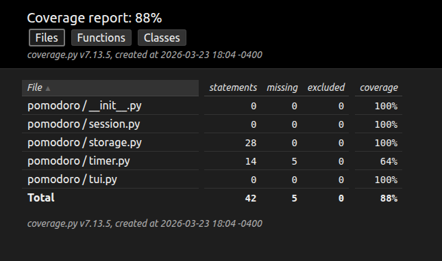

# Python Package Exercise

An exercise to create a Python package, build it, test it, distribute it, and use it. See [instructions](./instructions.md) for details.

# The following is just the tentative layout of this readme file. Feel free to adjust it. (Remove this line before submission)

- The badge (placeholder)
- Description
- Link to the package on the PyPI website
- how a developer who wants to import your project into their own code can do so - include documentation and code examples for all functions in your package and a link to an example Python program that uses each of them.
- how a developer who wants to contribute to your project can set up the virtual environment, install dependencies, and build and test your package for themselves.
- the names of all teammates as links to their GitHub profiles in the README.md file.
- instructions for how to configure and run all parts of your project for any developer on any platform - these instructions must work!
- instructions for how to set up any environment variables and import any starter data into the database, as necessary, for the system to operate correctly when run.
- if there are any "secret" configuration files, such as .env or similar files, that are not included in the version control repository, examples of these files, such as env.example, with dummy data must be included in the repository and exact instructions for how to create the proper configuration files and what their contents should be must be supplied to the course admins by the due date.

# Description

This package provides a simple Pomodoro timer system that allows developers to create, store, and manage timers programmatically.

## PyPl Link

[PyPl](foo.boo)

=======
## Contributors

- [Michael Miao](https://github.com/miaom-Konkon)
- [Simon Ni](https://github.com/NarezIn)
- [Name](github-page-link)
- [Name](github-page-link)
- [Name](github-page-link)

# For Users

## Installation

## API Documentation

# For Developers

## How to Contribute

1. If you use Windows OS, switch to git bash and then proceed. If you use a Unix-like OS, just proceed. 

2. Clone the repository:

   ```shell
   $ git clone https://github.com/swe-students-spring2026/3-package-emperor_penguins.git
   ```

3. Create a virtual environment using `pipenv`. Please make sure you global python interpreter has `pipenv` installed. If not, install it:

   ```shell
   $ python -m pip install pipenv
   ```

4. After you have `pipenv` installed, install all dependencies and activate a virtual environment

   ```shell
   $ python -m pipenv install --dev
   $ python -m pipenv shell
   ```

5. Now you should've noticed a prompt prefix in the terminal:

   ```shell
   (3-package-emperor_penguins) xxx$ 
   ```

   This indicates that you've been placed in a virtual environment!

6. *(optional)* Note that in some cases after your entry to the virtual environment, the texts that you code in the prompt might be invisible. Whenever this happens, run:

   ```shell
   $ stty echo
   ```

   and return. Now the texts you code should be visible again.

## Run Coverage Tests

1. Make sure you've completed all the setup steps above.

2. Place all the test files under:

   ```
   3-package-emperor_penguins/tests
   ```

3. Direct to the root directory of the project:

   ```shell
   $ cd xxx/3-package-emperor_penguins
   ```

4. Run the automatic coverage test script:

   ```shell 
   $ source run-test.sh
   ```

   - Ideally, this will launch an automatic testing and display the coverage result in the default web browser.

