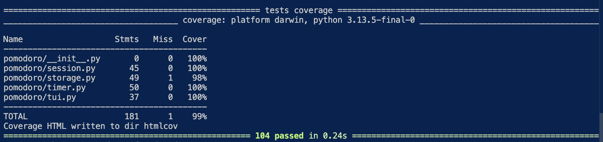

# Python Package Exercise

An exercise to create a Python package, build it, test it, distribute it, and use it. See [instructions](./instructions.md) for details.


[](https://github.com/swe-students-spring2026/3-package-emperor_penguins/actions/workflows/build-test.yaml)

# Description

This package provides a simple Pomodoro timer system that allows developers to create, store, and manage timers programmatically.

## PyPl Link

[PyPl](https://pypi.org/project/pomodoro-penguin/1.0.1/)

## Contributors

- [Michael Miao](https://github.com/miaom-Konkon)
- [Simon Ni](https://github.com/NarezIn)
- [Aryaman Nagpal](https://github.com/aryamann04)
- [Lan Nguyen](https://github.com/lpn4939-web)
- [Name](github-page-link)

# For Users

## Installation

Install the package via PyPI:

```bash
$ python -m pip install pomodoro-penguin
```

or if you are installing locally:

```shell
$ git clone https://github.com/swe-students-spring2026/3-package-emperor_penguins.git
$ cd 3-package-emperor_penguins
$ python -m pip install .
```

## Running the Pomodoro Timer

After installing, you can run the terminal-based Pomodoro timer as follows:

```shell
$ python -m pomodoro --work 25 --break 5 --cycles 4
```

### Parameters

- `--work` (`-w`) — Work duration in minutes (default: 25)
- `--break` (`-b`) — Break duration in minutes (default: 5)
- `--cycles` (`-c`) — Number of Pomodoro cycles (default: 4)
- `--history` – Print history of Pomodoro cycles with its ID and Durations
- `--use-timer` - Paste timer ID from history and run it normally
- `--version` (`-v`) — Show the version of the Pomodoro TUI and exit

### Example

```
python -m pomodoro -w 10 -b 3 -c 2
```

This will start a Pomodoro session with:

- 10 minutes of work
- 3 minutes of break
- 2 cycles in total

The terminal will show the current sub-session and a progress bar for either studying or resting.

# For Developers

## How to Contribute

1. If you use Windows OS, switch to git bash and then proceed. If you use a Unix-like OS, just proceed. 

2. Clone the repository:

   ```shell
   $ git clone https://github.com/swe-students-spring2026/3-package-emperor_penguins.git
   ```

3. Create a virtual environment using `pipenv`. Please make sure you global python interpreter has `pipenv` installed. If not, install it:

   ```shell
   $ python -m pip install pipenv
   ```

4. After you have `pipenv` installed, install all dependencies and activate a virtual environment

   ```shell
   $ python -m pipenv install --dev
   $ python -m pipenv shell
   ```

5. Now you should've noticed a prompt prefix in the terminal:

   ```shell
   (3-package-emperor_penguins) xxx$ 
   ```

   This indicates that you've been placed in a virtual environment!

6. *(optional)* Note that in some cases after your entry to the virtual environment, the texts that you code in the prompt might be invisible. Whenever this happens, run:

   ```shell
   $ stty echo
   ```

   and return. Now the texts you code should be visible again.

## Run Coverage Tests

1. Make sure you've completed all the setup steps above.

2. Place all the test files under:

   ```
   3-package-emperor_penguins/tests
   ```

3. Direct to the root directory of the project:

   ```shell
   $ cd xxx/3-package-emperor_penguins
   ```

4. Run the automatic coverage test script:

   ```shell 
   $ source run-test.sh
   ```

   - Ideally, this will launch an automatic testing and display the coverage result in the default web browser.


## [Example Code]("./example.py")

